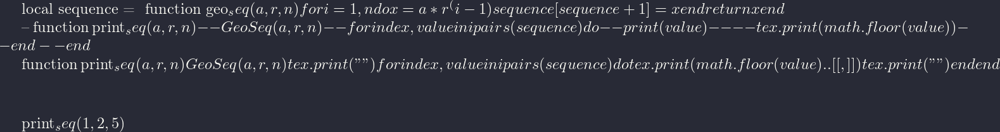

#+TITLE: org-incremental
#+BRAIN_FRIENDS: 1917a9f7-ee66-4023-a0ff-f9e52a0970c1 incremental_reading
#+BRAIN_PARENTS: system literate-projects
#+PROPERTY: header-args :noweb yes
#+FILETAGS: incremental
#+org_incremental: t
# #+LATEX_HEADER: \usepackage{minted}
#+LATEX_HEADER: \usepackage{tikz}
#+LATEX_HEADER: \usepackage{svg}
#+OPTIONS: tex:t

This package is designed to bring [[https://supermemo.guru/wiki/Incremental_writing][incremental writing]], [[https://help.supermemo.org/wiki/Incremental_mail_processing][incremental mail processing]] and incremental [[http://www.literateprogramming.com/][literate programming]] capabilities to org-mode and Emacs.

It works with [[https://github.com/alphapapa/org-ql][org-ql]] in order to find and generate lists of included files.

Key functions we would need:
- A-factor
- Priority
- Postpone/Reschedule (Intra- and inter-day)
- Dismissing (of files and sub-headers)
- Mercy
- TODO keywords: ("to write", "to expand", "to rewrite", "to review", "finished")
- Statistical analysis to chart the progress through the writing material (~magit~ and ~calendar~)
- Outstanding headline sorting by priority to match circadian cycles (high for high alertness and low for end of day)

Features:

  + *Incremental literate programming* with org-mode and SM's algorithm!
  + *Incremental writing of email with tools like ~mu4e~!*
  + *Deadline awareness* (modify priority/a-factor/scheduled date based on distance to deadline)

* Overview
:PROPERTIES:
:CREATED:  [2021-09-08 Wed 21:38]
:ID:       a981430d-1319-4d5a-b036-c1478fdf7cd4
:END:

** NEXT [#5] Why incremental writing?                             :incremental:
SCHEDULED: <2023-03-15 Wed>
:PROPERTIES:
:CREATED:  [2021-07-26 Mon 17:42]
:ID:       d334935e-79f3-4c5d-a614-61f902e6ecb9
:LAST_REVIEWED: [Y-02-27 Mon 15:%]
:TOTAL_REPEATS: 4
:OLD_INTERVAL: 8
:NEW_INTERVAL: 16
:A_FACTOR: 2.0
:END:

Incremental writing is a concept co-developed by Piotr Wozniak and [[https://supermemopedia.com/wiki/How_I_use_creative_elaboration_with_the_help_of_incremental_reading][users of Supermemo]], employing its topic spacing feature to break writing projects into sub-chapters, which are then worked on in an 'incremental fashion', allowing the spacing algorithm to feed a writer these subsections with non-zero intervals between writing sessions - taking advantage of the spacing effect as a form of creative elaboration.

The spacing effect is a well-known psychological phenomenon that suggests that learning is more effective when information is presented over time, rather than all at once. This means that it is better to study or practice a subject in multiple sessions over time, rather than trying to learn everything at the same time (session).

Leveraging the spacing effect in the form of incremental writing allows a writer works on multiple writing projects 'simultaneously', rather than focusing on just one project for an extended period of time.

This approach can help writers overcome writer's block and produce more consistent work. By working on multiple writing projects simultaneously, a writer can take advantage of the spacing effect to improve their learning and memory. For example, if a writer spends a couple of hours working on one project, then switches to another project, then comes back to the first project later, they will be more likely to have worked through what they wrote subconsciously and be able to improve on it. This can help them produce better-quality work and avoid getting stuck on just one project.

The forgetting effect: ;;TODO try find Wozniak's article about jumping hills

Woz [[http://help.supermemo.org/wiki/Creativity_and_problem_solving_in_SuperMemo#Incremental_writing][writes]]:
#+begin_quote
(Texts)... may be bloated and repetitive, however, with incremental reading, they can be prioritized in a rational way. *Incremental writing leaves the texts highly granular and the flow of thought is jagged*, however ... this is an advantage as all individual articles and subarticles *carry sufficient local context to be read independently*.
#+end_quote

The above relates to the granularity of articles written using IW lending itself to IR as extracts tend to be discrete. In the context of incremental literate programming, I believe the contextualisation provided by prose-around-code, encapsulated in subheadings offer these same advantages while also then allowing us to use the spacing effect over blocks of code. Org-mode's narrowing and widening features further help to constrain or expand context in the flow of IW.

Donald Knuth's "Literate Programming" is a programming methodology that involves combining human-readable text with code in a way that makes the code more understandable and easier to follow. This is accomplished by treating the code as a form of literature, in which the programmer writes prose to explain and document the code, interspersed with the code itself. The resulting "literate programs" are easier to read and understand than traditional programs, which can make them more maintainable and more likely to be used and reused by others. Additionally, the use of literate programming can make the process of writing and maintaining code more enjoyable and rewarding for the programmer, as it allows them to express themselves and their ideas in a more natural and intuitive way. Overall, the benefits of literate programming include improved readability, maintainability, and reusability of code, as well as increased enjoyment and satisfaction for the programmer.

It is possible to combine Piotr Wozniak's "Incremental Writing" and Donald Knuth's "Literate Programming" into a single concept called "Incremental Literate Programming." As seen, Incremental Writing is a method of writing that involves starting with a small amount of text and then gradually adding to it over time, rather than trying to write everything at once. Literate Programming is a programming methodology that involves combining human-readable text with code in a way that makes the code more understandable and easier to follow.

The subheadings can help to structure and organize the code, making it more understandable and easier to follow. Additionally, the use of subheadings can make it easier to use the spacing effect to review and retain blocks of code over time. The narrowing and widening features in org-mode can also be used to constrain or expand the context in the flow of incremental writing, further improving the readability and usability of the code. Overall, the combination of incremental writing and literate programming can provide a powerful and effective way to write and maintain complex programs.

The "spacing effect" is a psychological phenomenon that refers to the tendency for information to be more effectively learned and retained when it is presented and reviewed over a series of spaced intervals, rather than being presented and reviewed all at once. In the context of incremental literate programming, the spacing effect can be used to assist with the learning and retention of blocks of code. By breaking the code up into smaller, manageable units and reviewing them over spaced intervals, the programmer can more effectively commit the code to memory and retain their knowledge of it over time. This can make the code easier to understand and work with, as well as making it more likely that the programmer will be able to recall and use the code when needed. Additionally, the use of the spacing effect can help to make the process of learning and working with code more efficient and less overwhelming, as it allows the programmer to focus on smaller amounts of information at a time.

** NEXT Getting started
:PROPERTIES:
:CREATED:  [2022-07-22 Fri 11:21]
:ID:       141e0838-84a7-4f35-90b3-9ec544c98119
:END:

Files can be included with a ~#+incremental_writing: t~ header.

Example configuration:

#+begin_src elisp :eval no
(use-package! org-incremental
  :config
  (setq org-incremental-todo-keywords '("NEXT")))
#+end_src

* Topic spacing algorithm
:PROPERTIES:
:CREATED:  [2021-07-23 Fri 17:53]
:ID:       b58fcb07-0654-4120-a26a-0347c41b621b
:END:

In short, the basic algo for spacing topics is here:

#+begin_example
(Interval=OldInterval*AFActor)
#+end_example

- The first metric is self explanatory, but ~A-factor~ [fn:1] (standing for /absolute difficulty factor/) is more complicated in that it is used in older versions (<SM18) of Supermemo to represent element difficulty. It is still used for topics but not items in the current version.

The base value for ~A-factor~ in Supermemo is =2.0=, and so in essence the algo is simply a doubling mechanism:

#+name: a-factor
#+begin_src elisp :results silent
(defcustom a-factor 2.0
  "Base a-factor value as per Supermemo defaults."
  :type 'float
  :group 'org-incremental)
#+end_src

** NEXT Write working latex sequence
:PROPERTIES:
:CREATED:  [2022-08-09 Tue 11:40]
:ID:       61acbe6b-3cc2-42d2-a4f8-b30777f2ddd8
:TRIGGER:  chain-find-next(NEXT,from-current,priority-up,effort-down)
:HEADER-ARGS: :eval no
:END:

The review spacings can thus be represented as a simple geometric sequence ($x_n=ar^{(n-1)}$) with =2= as the common ratio:

#+name: geometric-sequence-lua
#+begin_src lua :noweb yes :results silent
function geo_seq (a, r, n)
   local sequence = {}
   for i = 1, n do
   local x = a * r^(i-1)
   sequence[#sequence+1] = x
   end
   -- Ensure we are returning the table, not just the last value (x)
   return sequence
end

function print_seq (a, r, n)
  -- Capture the returned table into a variable called 'seq'
  local seq = geo_seq(a, r, n)
  for index, value in ipairs(seq) do
    print(value)
    -- tex.print(math.floor(value))
  end
end
#+end_src

We can see here that the function prints up to the 5th position:
#+begin_src lua :noweb yes :var a_factor=(eval 'a-factor) :results output pp
<<geometric-sequence-lua>>
print_seq(1, a_factor, 5)
#+end_src

#+RESULTS:
: 1.0
: 2.0
: 4.0
: 8.0
: 16.0

#+NAME: geo-progression
#+HEADER: :headers '("\\usepackage{tikz}" "\\usepackage{luacode}")
#+BEGIN_SRC latex :results graphics file :file img/progression.png :noweb yes :export no
% \pgfsetxvec{\pgfpoint{1.5cm}{0cm}}
\begin{luacode}
  <<geometric-sequence-lua>>

  function print_seq (a, r, n)
  GeoSeq(a, r, n)
  tex.print("")
  for index, value in ipairs(sequence) do
  tex.print(math.floor(value)..[[, ]])
  tex.print("")
  end
  end

\end{luacode}

\newcommand\printseqq[3]{\directlua{print_seq(#1,#2,#3)}}

\printseqq{1}{2}{5}
\begin{tikzpicture}[scale = 0.3]
  \node[above] {$\dfrac{x_n=1 x 2^{(n-1)}$};
    \\
    \pgfsetxvec{\pgfpoint{1.5cm}{0cm}}
    \draw[latex-latex] (0,0) -- (20,0);
    \foreach \i in {0,...,20} {
      \draw (\i,0) -- (\i,-0.2) node[below] {\i};
    }
    % \printseqq{1}{2}{5}
    % \directlua{print_seq(#1,#2,#3)}
    % \directlua{tex.sprint(print_seq(#1,#2,#3))}
    % \foreach \x in \printseq{1}{2}{5} {
    \foreach \x in {1,2,4,8} {
     \draw[->, bend left] (\x,0) to (\x*2,0);
     }
    % \foreach \x in {\printseq{1}{2}{5}}
    % \draw[->, bend left] (\x-1,0) to (\x,0);
  \end{tikzpicture}
#+END_SRC

#+RESULTS: geo-progression

#+NAME: exponential-timeline
#+HEADER: :headers '("\\usepackage{tikz}" "\\usepackage{luacode}")
#+begin_src latex :results file graphics replace :exports results :headers '("\\usepackage{tikz}" "\\usepackage{luacode}") :latex-compiler lualatex :file img/exponential_timeline.pdf
\begin{tikzpicture}[scale = 0.6]
    % 1. Draw the underlying number line axis (0 to 18 days)
    \draw[latex-latex, thick, gray] (-0.5,0) -- (18.5,0);
    \foreach \i in {0,...,18} {
      \draw[gray] (\i, 0.1) -- (\i, -0.1) node[below, scale=0.8, black] {\i};
    }
    
    % Label the axis
    \node[right] at (19, 0) {Days};

    % 2. Dynamic Lua engine generating the exponential TikZ arches
    \begin{luacode*}
      -- Pure, encapsulated sequence generator
      function geo_seq (a, r, n)
         local sequence = {}
         for i = 1, n do
            sequence[#sequence+1] = a * r^(i-1)
         end
         return sequence
      end

      -- Generate our spacing sequence: 1, 2, 4, 8, 16
      local seq = geo_seq(1, 2, 5)

      -- Loop through the sequence and print out TikZ arc commands
      for i = 1, #seq - 1 do
         local current = seq[i]
         local next_val = seq[i+1]
         
         -- We use double backslashes so LaTeX registers the control sequences properly
         -- tex.print outputs strings straight into the LaTeX stream
         tex.print(string.format("\\draw[->, line width=1pt, blue!70!black, bend left=45] (%d,0) to (%d,0);", current, next_val))
      end
    \end{luacode*}

    % 3. Highlight the sequence milestones with clear markers
    \foreach \x in {1, 2, 4, 8, 16} {
       \filldraw[red!80!black] (\x, 0) circle (3pt);
    }
    
    % Title/Legend
    \node[above, font=\bfseries] at (9, 3.5) {Spaced Repetition: Interval Explosion Visualized};
    \node[above, scale=0.9, text=gray] at (9, 3.0) {Interval = OldInterval $\times$ A-Factor (2.0)};

\end{tikzpicture}
#+end_src

These results are then sorted by priority, a user defined variable at the core of both incremental reading and writing.

It should be noted that a key tool in the process is occasionally micromanaging interval lengths, which might grow at an undesirable rate for important articles and thus needs to be manually shortened from time to time.

*** TODO Lua number line
:PROPERTIES:
:CREATED:  [2023-04-17 Mon 10:14]
:ID:       927bafa9-4ea1-4813-b573-bcd1fda16ac7
:END:

Can you write geometric sequence number line in luatex?

This code creates a TikZ picture with an x-axis labeled "n" and a y-axis labeled "a_n". It then plots a geometric sequence with a starting value of 2 and a common ratio of 3, using the specified number of terms. The sequence is plotted on the number line, and tick marks are placed along both the x-axis

Can you create a geometric sequence function in Lua and then recreate the same function in the Fennel language?

This code defines a function geometric_sequence that takes three arguments: the starting value of the sequence (start), the common ratio of the sequence (ratio), and the number of terms in the sequence (numterms). The function generates the sequence by looping through the desired number of terms and calculating each term using the previous term and the common ratio. The generated sequence is then returned as a table.

** Topic spacing algorithm in Elisp
:PROPERTIES:
:CREATED:  [2021-08-31 Tue 15:05]
:ID:       5a4ff6c0-c4a6-4d44-8fdc-aeb488fedaff
:END:

Instead of re-implementing a geometric sequence directly, we'll copy SM's simple function and have our code act off of repetition data written to the ~:PROPERTIES:~ drawer or database depending on which backend the user chooses.

In the functional style the interval determining algorithm:
- We use =round= here because human work days are measured in real days, which means we have a full circadian cycle between reps.

#+begin_src elisp :noweb-ref spacing-algo :results silent
(defun org-incremental-determine-next-interval (old-interval a-factor)
  "Calcuate new interval for current headline.
Uses: (Interval=OldInterval*AFactor)"
  (let* ((safe-old (if (or (not old-interval) (= old-interval 0)) 1 old-interval))
         (next-interval (* safe-old a-factor)))
    (round next-interval)))

#+end_src

This can be compared to a geometric sequencer:
Note that we don't use ~cl-assert~ here when testing that r is greater than 0, as this macro can be stripped out based on the configuration of the ~cl-assertions~ variable.
#+begin_src elisp :noweb-ref spacing-algo :eval yes :results silent
(defun org-incremental-geometric (a r n)
  "Take the first term `A' and multiply by the common ratio `R'
To produce `N'th value in a sequence"
  ;; 1. Hard runtime type/boundary enforcement
  (unless (and (numberp r) (> r 0))
    (signal 'wrong-type-argument (list 'greater-than-zero-p r)))
  ;; 2. Sequence calculation core
  (if (> n 0)
    (* a (expt r (1- n)))))
#+end_src

Then test by generating 5th element in series and comparing the values emitted by both functions:

#+begin_src elisp :noweb-ref tests :results silent
(ert-deftest test-org-incremental-spacing-5th-element ()
  "Test that both the functional step algorithm and the geometric sequencer
agree on the 5th element in the repetition series."
  (let ((a-factor 2.0))
    ;; Assert that the geometric sequence for N=5 yields 16
    (should (= (round (org-incremental-geometric 1 a-factor 5)) 
               16))
    
    ;; Assert that the sequential step algorithm (using previous interval 8)
    ;; matches the geometric target of 16
    (should (= (org-incremental-determine-next-interval 8 a-factor) 
               16))
    
    ;; Directly compare the two approaches
    (should (= (org-incremental-determine-next-interval 8 a-factor)
               (round (org-incremental-geometric 1 a-factor 5))))))

(ert-deftest test-org-incremental-geometric-edge-case ()
  "Ensure that the geometric function errors out gracefully on invalid ratios."
  (should-error (org-incremental-geometric 1 0 5)
                :type 'wrong-type-argument))

(ert-deftest test-org-incremental-initial-interval ()
  "Treat a missing or zero interval as the initial one-day interval."
  (should (= (org-incremental-determine-next-interval nil 2.0) 2))
  (should (= (org-incremental-determine-next-interval 0 2.0) 2)))

#+end_src

#+begin_src elisp :eval yes :results silent
(ert 'test-org-incremental-spacing-5th-element)
#+end_src

* Scheduler                                                       :incremental:
:PROPERTIES:
:CREATED:  [2021-08-31 Tue 18:15]
:ID:       e02e162b-2845-4dd2-9e09-b40792302541
:LAST_REVIEWED: 0
:TOTAL_REPEATS: 0
:OLD_INTERVAL: 0
:NEW_INTERVAL: 1
:A_FACTOR: 2.0
:END:

The scheduler contains functions for determining the next interval of a headline and applying that date using org-mode internals.
Where possible, we maintain a core of pure functions and hand off state to boundary helpers.

** Calculate next state
:PROPERTIES:
:CREATED:  [2026-06-05 Fri 08:46]
:ID:       0aa0f7d6-580e-406b-a0c4-f896be62d3dc
:END:

Pure state transition function to calculate next state of current headline as a plist:
#+begin_src elisp :noweb-ref element-rescheduler :results silent
(defun org-incremental-calculate-next-state (old-interval a-factor prior-reps current-time)
  "Purely compute the next state updates based on current tracking data.
Returns a plist containing the computed mutations."
  (let* ((new-interval (org-incremental-determine-next-interval old-interval a-factor))
         (safe-old (if (or (not old-interval) (= old-interval 0)) 1 old-interval)) ;; sanitize
         (next-reps (1+ (or prior-reps 0))) ;; structural shield against unreviewed headlines
         (scheduled-time (time-add current-time (days-to-time new-interval))))
    (list :old-interval safe-old
          :new-interval new-interval
          :total-repeats next-reps
          :scheduled-time scheduled-time)))
#+end_src

Test the plist (no org mocking required)
#+begin_src elisp :noweb-ref tests :results silent
(ert-deftest test-org-incremental-calculate-next-state ()
  "Verify that the state transformer correctly builds the execution plist."
  (let* ((mock-now (encode-time '(0 0 0 1 1 2026 nil nil nil))) ; Fixed time anchor: Jan 1, 2026
         (old-interval 5)
         (a-factor 2.0)
         (prior-reps 3)
         (result (org-incremental-calculate-next-state old-interval a-factor prior-reps mock-now)))
    
    ;; Assert state transitions are accurate
    (should (= (plist-get result :old-interval) 5))
    (should (= (plist-get result :new-interval) 10))
    (should (= (plist-get result :total-repeats) 4))
    
    ;; Verify that time arithmetic output scales exactly matching the new interval (10 days)
    (let ((expected-future-time (time-add mock-now (days-to-time 10))))
      (should (equal (plist-get result :scheduled-time) expected-future-time)))

    ;; An unreviewed element starts from the one-day baseline.
    (let ((initial (org-incremental-calculate-next-state 0 2.0 nil mock-now)))
      (should (= (plist-get initial :old-interval) 1))
      (should (= (plist-get initial :new-interval) 2))
      (should (= (plist-get initial :total-repeats) 1)))))

#+end_src

#+begin_src elisp :eval yes :results silent
(ert 'test-org-incremental-calculate-next-state)
#+end_src

** Buffer mutating
:PROPERTIES:
:CREATED:  [2026-06-05 Fri 08:48]
:ID:       58196608-fae5-44dc-a12a-ccdc59860db6
:END:
Apply the base algorithm to existing ~:PROPERTIES:~ keys and then write the new interval, moving the previous interval into the "=OLD_INTERVAL=" key.
The element is rescheduled using ~org~'s internal =org-schedule= function which will be used later for building and sorting a que.

#+begin_src elisp :noweb-ref element-rescheduler :results silent
(defun org-incremental-review-item () ;; TODO use arguments
 "Collect values from headline at point, compute updates, and apply mutations."
  (interactive)
  ;; Ensure the entry is initialized
  (unless (org-incremental-entry-p)
    (org-incremental--init-element))
  
(let* ((old-interval (org-incremental-element-current-interval))
         (a-factor (org-incremental-element-a-factor))
         (prior-reps (org-incremental-element-total-repeats))
         (now (current-time))
         
         ;; Pass data into our pure calculation engine
         (updates (org-incremental-calculate-next-state old-interval a-factor prior-reps now))
         
         ;; Extract values from the resulting plist
         (new-int (plist-get updates :new-interval))
         (total-reps (plist-get updates :total-repeats)))
  
    ;; Apply the mutations to each org element
    (org-entry-put (point) "OLD_INTERVAL" (number-to-string (plist-get updates :old-interval)))
    (org-entry-put (point) "NEW_INTERVAL" (number-to-string new-int))
    (org-entry-put (point) "TOTAL_REPEATS" (number-to-string total-reps))
    (org-entry-put (point) "LAST_REVIEWED" (org-incremental-time-to-inactive-org-timestamp now))
    
    ;; Update native org scheduling
    (org-schedule nil (plist-get updates :scheduled-time))
    
    (message "Scheduled out %d days ahead. (Repetition #%d)" new-int total-reps)))
#+end_src

Integration test using a temporary buffer and ~cl-letf~:
#+begin_src elisp :noweb-ref tests :eval yes :results silent
(ert-deftest test-org-incremental-review-item-integration ()
  "Verify that `org-incremental-review-item` accurately updates buffer properties and schedule tags."
  (with-temp-buffer
    ;; 1. Setup Environment: Initialize major mode and dummy Org tree
    (org-mode)
    (insert "* TODO Master Functional Programming in Elisp
:PROPERTIES:
:NEW_INTERVAL: 4
:A_FACTOR:    2.5
:TOTAL_REPEATS: 2
:END:
")
    
    ;; 2. Place point (cursor) on the headline 
    (goto-char (point-min))
    
    ;; 3. Mock Environmental Dynamics
    ;; Patch `current-time` so that test is deterministic regardless of when it runs.
    ;; We also stub package's metadata extraction utilities for precise isolation.
    (let ((mock-now (encode-time '(0 0 0 1 1 2026 nil nil nil)))) ; Fixed Anchor: Jan 1, 2026
      (cl-letf* (((symbol-function 'current-time) 
                  (lambda () mock-now))
                 ((symbol-function 'org-incremental-entry-p) 
                  (lambda () t))
                 ((symbol-function 'org-incremental-element-current-interval) 
                  (lambda () 4))
                 ((symbol-function 'org-incremental-element-a-factor) 
                  (lambda () 2.5))
                 ((symbol-function 'org-incremental-element-total-repeats) 
                  (lambda () 2))
                 ((symbol-function 'org-incremental-time-to-inactive-org-timestamp) 
                  (lambda (_time) "[2026-01-01 Thu]")))
        
        ;; 4. Execute the interactive command under test
        (org-incremental-review-item)
        
        ;; 5. Verification Phase: Assert property mutations match expected pure states
        ;; (Interval 4 * A-Factor 2.5 = Next Interval 10)
        (should (equal (org-entry-get (point) "OLD_INTERVAL") "4"))
        (should (equal (org-entry-get (point) "NEW_INTERVAL") "10"))
        (should (equal (org-entry-get (point) "TOTAL_REPEATS") "3"))
        (should (equal (org-entry-get (point) "LAST_REVIEWED") "[2026-01-01 Thu]"))
        
        ;; 6. Verification Phase: Check Org-mode's native scheduling insertion
        ;; 10 days added to Jan 1, 2026 lands precisely on Jan 11, 2026.
        (goto-char (point-min))
        (should (search-forward "SCHEDULED: <2026-01-11" nil t))))))
#+end_src

#+begin_src elisp :eval yes :results silent
(ert 'test-org-incremental-review-item-integration)
#+end_src

** Scheduling properties
:PROPERTIES:
:CREATED:  [2022-12-06 Tue 11:19]
:ID:       35f2cb30-7887-4e8a-b5c5-c506ddffb082
:END:

Instead of a hard-coded array of strings, use a getter function to eval ~defcustom~ entries dynamically and so avoid property drift.
#+begin_src elisp :noweb-ref element-properties :results silent
(defun org-incremental-get-all-properties ()
  "Return a list of active property keys based on user configurations."
  (list org-incremental-a-factor-property
        org-incremental-old-interval-property
        org-incremental-new-interval-property
        org-incremental-total-repeats-property
        org-incremental-created-property
        org-incremental-last-reviewed-property))
#+end_src

Customs
#+begin_src elisp :noweb-ref element-properties :results silent
(defvar org-incremental-current-element-uuid nil)

(defvar org-incremental-previous-element-uuid nil)

(defcustom org-incremental-a-factor-property "A_FACTOR"
  "Property to store the given element's `a-factor'."
  :type 'string
  :group 'org-incremental)

(defcustom org-incremental-new-interval-property "NEW_INTERVAL"
  "Name of property to store the new interval value."
  :type 'string
  :group 'org-incremental)

(defcustom org-incremental-old-interval-property "OLD_INTERVAL"
  "Name of property to store the old interval value."
  :type 'string
  :group 'org-incremental)

(defcustom org-incremental-total-repeats-property "TOTAL_REPEATS"
  "Name of property to store the total number of repeats."
  :type 'string
  :group 'org-incremental)

(defcustom org-incremental-created-property "CREATED"
  "Property displaying the creation time of an entry."
  :type 'string
  :group 'org-incremental)

(defcustom org-incremental-last-reviewed-property "LAST_REVIEWED"
  "Property displaying the creation time of an entry."
  :type 'string
  :group 'org-incremental)
#+end_src

Utility function to convert timestamps to org-mode format. We =car= ~org-time-stamp-formats~ to return only the date to avoid visual clutter in the resultant PROPERTIES drawer.
#+begin_src elisp :noweb-ref element-rescheduler :results silent
(defun org-incremental-time-to-inactive-org-timestamp (time)
  "Convert TIME into org-mode timestamp."
  (format-time-string
   (concat "[" (substring (car org-time-stamp-formats) 1 -1) "]") ;; use car for DATE-ONLY
   time))
#+end_src

Test time logic using a time encoded in the test process's local timezone:
#+begin_src elisp :noweb-ref tests :results silent
(ert-deftest test-org-incremental-timestamp-formatting ()
  "Ensure time converts correctly to an inactive Org date-only string."
  (let* ((test-time (encode-time 0 19 11 6 12 2022))
         (org-time-stamp-formats '("<%Y-%m-%d %a>" . "<%Y-%m-%d %a %H:%M>"))) ;; mock format
    (should (string= (org-incremental-time-to-inactive-org-timestamp test-time)
                     "[2022-12-06 Tue]"))))
#+end_src

#+begin_src elisp :results silent
(ert 'test-org-incremental-timestamp-formatting)
#+end_src

** NEXT Hypothetical next-review date
:PROPERTIES:
:CREATED:  [2022-12-13 Tue 13:01]
:ID:       562514ab-6106-43aa-8a45-cca2695e5d12
:END:

Lifted from ~org-drill~. We use this as a base to calculate an estimate of the next review for the current item, should the item feature along the sequence. Factors such as review load, priorities and actual reviews done can effect when an item is actually seen.

#+begin_src elisp :noweb-ref element-rescheduler :results silent
(defun org-incremental-hypothetical-next-interval (old-interval a-factor steps)
"Calculate the hypothetical next interval after STEPS repetitions."
(let ((next-interval old-interval))
    (dotimes (_ steps)
      (setq next-interval (org-incremental-determine-next-interval next-interval a-factor)))
    next-interval))

(defun org-incremental-hypothetical-next-review-dates (&optional steps-to-predict)
  "Return a list of the next N hypothetical review intervals.
Extracts OLD-INTERVAL and A-FACTOR from the properties of the current headline.
Defaults to predicting the next 5 steps."
  (let* ((steps (or steps-to-predict 5))
         ;; Extract properties from the current headline using your properties
         (old-interval-str (org-entry-get (point) org-incremental-old-interval-property))
         (a-factor-str (org-entry-get (point) org-incremental-a-factor-property))
         ;; Parse strings to numbers, defaulting to sensible start values if missing
         (old-interval (if old-interval-str (string-to-number old-interval-str) 1))
         (a-factor (if a-factor-str (string-to-number a-factor-str) 2.0))
         (intervals nil))
    
    ;; Generate the list of hypothetical future intervals
    (dotimes (s steps)
      (push (org-incremental-hypothetical-next-interval old-interval a-factor (1+ s))
            intervals))
    
    (reverse intervals)))
#+end_src

Test that we get a given element along the line:
#+begin_src elisp :noweb-ref tests :results silent
(ert-deftest test-org-incremental-hypothetical-next-interval ()
  "Ensure the hypothetical interval calculator correctly loops geometric incrementation."
  ;; 1 step: 1 * 2.0 = 2
  (should (= (org-incremental-hypothetical-next-interval 1 2.0 1) 2))
  
  ;; 3 steps: 1 -> 2 -> 4 -> 8
  (should (= (org-incremental-hypothetical-next-interval 1 2.0 3) 8))
  
  ;; 2 steps starting from 8: 8 -> 16 -> 32
  (should (= (org-incremental-hypothetical-next-interval 8 2.0 2) 32))

  ;; Rounding is applied after every step: 1 -> 2 -> 3 -> 5.
  (should (= (org-incremental-hypothetical-next-interval 1 1.68 3) 5)))
#+end_src

Check that ~OLD_INTERVAL~ and ~A_FACTOR~ properties are correctly read from current headline using a temp-buffer. 
#+begin_src elisp :noweb-ref tests :results silent
(ert-deftest test-org-incremental-hypothetical-next-review-dates ()
  "Ensure hypothetical dates are correctly parsed from a headline's properties."
  (with-temp-buffer
    (org-mode)
    ;; 1. Create a dummy headline
    (insert "* Test Headline\n")
    (goto-char (point-min))
    
    ;; 2. Set the properties dynamically using your defcustom variables
    (org-set-property org-incremental-old-interval-property "2")
    (org-set-property org-incremental-a-factor-property "3.0")
    
    ;; 3. Run the function asking for 3 steps
    ;; Expectation: 2 * 3 = 6 -> 18 -> 54
    (should (equal (org-incremental-hypothetical-next-review-dates 3) 
                   '(6 18 54)))
                   
    ;; 4. Test the fallback mechanism (if properties are missing)
    ;; Delete the properties
    (org-delete-property org-incremental-old-interval-property)
    (org-delete-property org-incremental-a-factor-property)
    
    ;; Expectation: Defaults to interval 1, a-factor 2.0 (1 -> 2 -> 4 -> 8)
    (should (equal (org-incremental-hypothetical-next-review-dates 3) 
                   '(2 4 8)))))
#+end_src

#+begin_src elisp :results silent
(ert 'test-org-incremental-hypothetical-next-interval)
(ert 'test-org-incremental-hypothetical-next-review-dates)
#+end_src

#+begin_src elisp :noweb-ref element-rescheduler :results silent
(defun org-incremental-show-future-schedule ()
  "Display the projected review intervals for the current item in the echo area."
  (interactive)
  (let ((intervals (org-incremental-hypothetical-next-review-dates)))
    (message "Projected future intervals (days): %s" 
             (mapconcat #'number-to-string intervals ", "))))
#+end_src

* Elements
:PROPERTIES:
:CREATED:  [2022-03-27 Sun 12:29]
:ID:       54d1f035-1536-451c-bdc9-3355c8597b76
:END:

Much of this is refactored code lifted from [[https://gitlab.com/phillord/org-drill/-/blob/master/org-drill.el][org-drill]] and [[https://www.leonrische.me/pages/org_flashcards.html][org-fc]].

Headlines are considered 'elements' when tagged with the =org-incremental-element-tag=:

#+begin_src elisp :noweb-ref element-options :results silent
(defcustom org-incremental-element-tag "incremental"
  "Tag for marking headlines as incremental writing elements."
  :type 'string
  :group 'org-incremental)

#+end_src

And are drawn from the customizable list of directories:
#+begin_src elisp :noweb-ref element-options :results silent
(defcustom org-incremental-directories (org-agenda-files)
  "Files or directories searched for incremental elements."
  :type '(repeat file)
  :group 'org-incremental)
#+end_src

If wanted, we can further refine our list of actionable candidates by specifying a TODO keyword(s) list:

#+begin_src elisp :noweb-ref element-options :results silent
(defcustom org-incremental-todo-keywords nil
  "If non-nil, supply list as viable TODO keyword(s)
to consider as rep-able `org-incremental' entries"
  :type 'string
  :group 'org-incremental)
#+end_src

** Element properties
:PROPERTIES:
:CREATED:  [2022-08-11 Thu 15:12]
:ID:       93ecad32-6f69-479a-9b5b-8d030af75c73
:END:
** Checking and moving to elements
:PROPERTIES:
:CREATED:  [2022-07-22 Fri 14:20]
:ID:       90ec04c0-2ece-4f34-a74e-81c6ffbcc860
:END:

Here we perform various checks over the element in question
#+begin_src elisp :noweb-ref element-checks :results silent
(defun org-incremental-entry-p ()
  "Check if the current heading is an incrementalised element."
  (member org-incremental-element-tag (org-get-tags nil 'local)))

#+end_src

#+begin_src elisp :noweb-ref element-checks :results silent
(defun org-incremental-operable-entry-p (marker)
  "Is MARKER, or the point, in an operable TODO?"
    (member (org-get-todo-state) org-incremental-todo-keywords))

#+end_src

#+begin_src elisp :noweb-ref element-checks :results silent
(defun org-incremental-entry-new-p ()
  "Return non-nil if the entry at point is new."
       (let ((element-time (org-get-scheduled-time (point))))
         (null element-time)))

#+end_src

Notice the need to test if the retrieved value is already a =0=, otherwise the ~org-time-stamp-now~ function fails.

#+begin_src elisp :noweb-ref element-checks :results silent
(defun org-incremental-entry-repped-today-p ()
  "Return non-nil if the entry at point was already repped today
Otherwise return t if the it was repped today or is a new element."
  (unless t (org-incremental-entry-new-p)
    (let ((reviewed-time (org-entry-get (point) org-incremental-last-reviewed-property)))
      (= 0 (org-time-stamp-to-now reviewed-time)))))

#+end_src

Shouldn't this be using UUID's? What constitutes =marker=?
#+begin_src elisp :noweb-ref element-checks :results silent
(defun org-incremental-goto-entry (marker)
  "Switch to the buffer and position of MARKER."
  (switch-to-buffer (marker-buffer marker))
  (goto-char marker))

#+end_src

#+begin_src elisp :results silent
;; Defined in ~/.emacs.d/.local/straight/repos/org-drill/org-drill.el
(defun org-drill-map-entries (func &optional scope drill-match &rest skip)
  "Like `org-map-entries', but only drill entries are processed."
  (let ((org-drill-match (or drill-match org-drill-match)))
    (apply 'org-map-entries func
           (concat "+" org-incremental-element-tag
                   (if (and (stringp org-drill-match)
                            (not (member (elt org-drill-match 0) '(?+ ?- ?|))))
                       "+" "")
                   (or org-drill-match ""))
           (org-drill-current-scope scope)
           skip)))

#+end_src

** Element creation
:PROPERTIES:
:CREATED:  [2021-11-29 Mon 12:23]
:ID:       72ca6a31-4fe7-45ae-aba2-2d68711693a0
:END:

#+begin_src elisp :noweb-ref element-creation-functions :results silent
(defun org-incremental--add-tag (tag)
  "Add TAG to the heading at point."
  (org-set-tags
   (cl-remove-duplicates
    (cons tag (org-get-tags nil 'local))
    :test #'string=)))

(defun org-incremental--remove-tag (tag)
  "Add TAG to the heading at point."
  (org-set-tags
   (remove tag (org-get-tags nil 'local))))

#+end_src

The below function is used to create an incrementalized headline. The tagging lets us know that it should be scheduled.

#+begin_src elisp :noweb-ref element-creation-functions :results silent
(defun org-incremental--init-element ()
  "Initialize the current headline as a topic."
  (if (org-incremental-entry-p)
      (error "Headline is already an incremental element"))
  (org-back-to-heading)
  (org-id-get-create)
  (org-expiry-insert-created)
  (org-set-property org-incremental-last-reviewed-property "0") ;; TODO can all this be collapsed?
  (org-set-property org-incremental-total-repeats-property "0")
  (org-set-property org-incremental-old-interval-property "0")
  (org-set-property org-incremental-new-interval-property "1") ;; this kicks off the geo seq
  (org-set-property org-incremental-a-factor-property (number-to-string a-factor))
  (org-incremental--add-tag org-incremental-element-tag)
  (if org-incremental-prompt-for-priority-p
      (let ((org-priority-highest org-incremental-priority-highest)
            (org-priority-lowest org-incremental-priority-lowest)
            (org-priority-default org-incremental-default-priority))
       (org-priority))))
#+end_src

If we use the =#+org_incremental: t= buffer option perhaps we can steal ~org-auto-tangle~'s functionality and check the buffer on save for actionable TODOs or headers that have not yet been initialized and turn them into elements.

** Retrieve element data
:PROPERTIES:
:CREATED:  [2021-11-29 Mon 10:35]
:ID:       3d66a38f-e251-4e81-aeb1-8abdd41c770b
:END:

Bring in some functionality for interacting with data stored the ~:PROPERTIES:~ drawer.

#+begin_src elisp :noweb-ref element-stats :results silent
(defun org-incremental-element-old-interval (&optional default)
  "Return previous interval for element at point."
  (let ((val (org-entry-get (point) org-incremental-old-interval-property)))
    (if val
        (string-to-number val)
      (or default 0))))

(defun org-incremental-element-a-factor (&optional default)
  "Return the A-factor for the element at point."
  (let ((val (org-entry-get (point) org-incremental-a-factor-property)))
    (if val
        (string-to-number val)
      (or default 0))))

(defun org-incremental-element-current-interval (&optional default)
  "Return pre-rep interval for element at point."
  (let ((val (org-entry-get (point) org-incremental-new-interval-property)))
    (if val
        (string-to-number val)
      (or default 0))))

(defun org-incremental-element-total-repeats (&optional default)
  "Return total number of repeats for the element at point."
  (let ((val (org-entry-get (point) org-incremental-total-repeats-property)))
    (if val
        (string-to-number val)
      (or default 0))))

#+end_src

#+begin_src elisp :noweb-ref tests :results silent
(ert-deftest test-org-incremental-element-initialization-and-properties ()
  "Initialize an element and read its scheduling properties back."
  (let* ((file (make-temp-file "org-incremental-test-" nil ".org"
                               "* New element\n"))
         (buffer (find-file-noselect file)))
    (unwind-protect
        (with-current-buffer buffer
          (org-mode)
          (goto-char (point-min))
          (let ((a-factor 2.5)
                (org-expiry-created-property-name org-incremental-created-property))
            (org-incremental--init-element))
          (should (org-incremental-entry-p))
          (should (= (org-incremental-element-old-interval) 0))
          (should (= (org-incremental-element-current-interval) 1))
          (should (= (org-incremental-element-a-factor) 2.5))
          (should (= (org-incremental-element-total-repeats) 0))
          (should (org-entry-get (point) org-incremental-created-property)))
      (when (buffer-live-p buffer)
        (kill-buffer buffer))
      (delete-file file))))

(ert-deftest test-org-incremental-property-access-honors-custom-names ()
  "Read element data through the configured property names."
  (with-temp-buffer
    (org-mode)
    (insert "* Configured element\n")
    (goto-char (point-min))
    (let ((org-incremental-old-interval-property "OI")
          (org-incremental-new-interval-property "NI")
          (org-incremental-a-factor-property "AF")
          (org-incremental-total-repeats-property "TR"))
      (org-set-property "OI" "3")
      (org-set-property "NI" "7")
      (org-set-property "AF" "1.5")
      (org-set-property "TR" "4")
      (should (= (org-incremental-element-old-interval) 3))
      (should (= (org-incremental-element-current-interval) 7))
      (should (= (org-incremental-element-a-factor) 1.5))
      (should (= (org-incremental-element-total-repeats) 4)))))
#+end_src

#+begin_src elisp :noweb-ref element-stats :results silent
(defun org-incremental-get-element-data ()
  "Returns a list of 3 elements, containing all the stored recall
  data for the element at point:
- LAST-INTERVAL is the interval in days that was used to schedule the element's
  current review date.
- REPEATS is the number of times the element has been repeated.
- A-FACTOR is the number by which to space out a repped element.
"
  (let ((learn-str (org-entry-get (point) "LEARN_DATA"))
        (repeats (org-incremental-entry-total-repeats :missing)))
    (cond
     (learn-str
      (let ((learn-data (and learn-str
                             (read learn-str))))
        (list (nth 0 learn-data)        ; last interval
              (nth 1 learn-data)        ; repetitions
              (org-incremental-entry-failure-count)
              (nth 1 learn-data)
              (org-incremental-entry-last-quality)
              (nth 2 learn-data)        ; EF
              )))
     ((not (eql :missing repeats))
      (list (org-incremental-entry-last-interval)
            (org-incremental-entry-repeats-since-fail)
            (org-incremental-entry-total-repeats)
            (org-incremental-entry-average-quality)
            (org-incremental-entry-ease)))
     (t  ; virgin element
      (list 0 0 0 0 nil nil)))))
#+end_src

#+begin_src elisp :results silent
(defun org-incremental-days-since-last-review ()
  "Nil means a last review date has not yet been stored for
the element.
Zero means it was reviewed today.
A positive number means it was reviewed that many days ago.
A negative number means the date of last review is in the future --
this should never happen."
  (let ((datestr (org-entry-get (point) org-incremental-last-reviewed-property)))
    (when datestr
      (- (time-to-days (current-time))
         (time-to-days (apply 'encode-time
                              (org-parse-time-string datestr)))))))
#+end_src

** Store element data
:PROPERTIES:
:CREATED:  [2021-11-29 Mon 10:37]
:ID:       7669d568-a905-4adb-b579-d6b5fd0053e3
:END:

#+begin_src elisp :eval no
(defun org-incremental-store-element-data (last-interval repeats total-repeats)
  "Stores the given data in the element at point."
  (org-entry-delete (point) "LEARN_DATA")
  (org-set-property "LAST_INTERVAL"
                    (number-to-string (org-drill-round-float last-interval 4))) ;; TODO refactor
  (org-set-property "TOTAL_REPEATS" (number-to-string total-repeats)))

#+end_src

** checks
:PROPERTIES:
:CREATED:  [2021-11-29 Mon 10:35]
:ID:       b50e5eb3-39da-48fb-af77-8016d12b577b
:END:

We need to introduce checks for valid A-factor and interval values.

#+begin_src elisp :results silent
(cl-assert (>= 2 2))
#+end_src

** Delete review data
:PROPERTIES:
:CREATED:  [2022-08-09 Tue 11:40]
:ID:       8d1b2b03-d39a-46a7-a0a7-b90ad714809f
:END:

This is for un-incrementalising an item - in Supermemo parlance this is known as 'forgetting'.
#+begin_src elisp :noweb-ref element-deletion-functions :results silent
(defun org-incremental-strip-entry-data ()
  (dolist (prop org-incremental-scheduling-properties)
    (org-delete-property prop))
  (org-schedule '(4)))
#+end_src

#+begin_src elisp :noweb-ref element-deletion-functions :results silent
(defun org-incremental-strip-all-data (&optional scope)
  "Delete scheduling data from every incremental entry in scope.
This function may be useful if you want to give your collection of
entries to someone else.  Scope defaults to the current buffer,
and is specified by the argument SCOPE, which accepts the same
values as `org-incremental-scope'."
  (interactive)
  (when (yes-or-no-p
         "Delete scheduling data from ALL items in scope: are you sure?")
    (cond
     ((null scope)
      ;; Scope is the current buffer. This means we can use
      ;; `org-delete-property-globally', which is faster.
      (dolist (prop org-incremental-scheduling-properties)
        (org-delete-property-globally prop))
      (org-incremental-map-entries (lambda () (org-schedule '(4))) scope))
     (t
      (org-incremental-map-entries 'org-incremental-strip-entry-data scope)))
    (message "Done.")))
#+end_src

** NEXT Archive headlines
:PROPERTIES:
:CREATED:  [2022-12-13 Tue 13:01]
:ID:       3f80b0d8-da09-4742-b078-f17afdf8f843
:END:
Functions to more elegantly 'archive' completed headlines.

Currently, when completing a TODO headline, we regenerate it to be placed along the spaced que. However, we need a mechanism to both completed the current item fully so that it is 'DONE', and then be able to archive the element with its repetition data, without actually losing the headline and the literate code contained within.

* Priority system
:PROPERTIES:
:CREATED:  [2021-11-29 Mon 13:24]
:ID:       a327cd46-cad0-450c-8cce-237bd691b47c
:END:

We can piggy back off of some more ~org~ functions:
- =org-default-priority= (30 in this case, with min being 60 and max 1)

Baseline function for setting priority at topic creation.
Inherit from custom priority.

#+begin_src elisp :eval no
(org-priority org-incremental-priority-default)
#+end_src

#+begin_src elisp :noweb-ref priority-system :results silent
(defcustom org-incremental-default-priority 'org-default-priority ;; TODO how to make this use system defaults?
  "Use a custom set of default priorities, ")

(defcustom org-incremental-priority-highest 'org-priority-highest
  "Set a custom highest priority for use in `incremental' items
Use the current org-priority if unset")

(defcustom org-incremental-priority-lowest 'org-priority-lowest
  "Set a custom lowest priority for use in `incremental' items
Use the current org-priority if unset")

#+end_src

Note that sorting numerical priorities does not seem to be working in ~org-ql~. See the relevant [[https://github.com/alphapapa/org-ql/issues/274][issue]].

Use a simple 1-10 range for now:
#+begin_src elisp :eval no
(setq org-priority-highest 1
      org-priority-lowest 10
      org-priority-default 5)
#+end_src

Experimenting with local
#+begin_src elisp :eval no
(setq-local org-priority-highest 1
            org-priority-lowest 10
            org-priority-default 5)
#+end_src

This might be useful for setting whether a created subtree implicitly inherits a parent priority (via cookies), inherits it explicitly (the priority is set textually) or via a custom function
#+begin_src elisp :noweb-ref priority-system :results silent
(defcustom org-incremental-priority-inheret 'default
  "Set how priorities are inherited amongst subtrees")
#+end_src

#+begin_src elisp :noweb yes :noweb-ref priority-system :results silent
(defcustom org-incremental-prompt-for-priority-p nil
  "If non-nil, prompt to select headline priority at element creation."
  :group 'org-incremental
  :type 'boolean)
#+end_src

Generic function for visually selecting an elements priority
See ~org-priority~
#+begin_src elisp :results silent
(defun org-incremental--select-priority ()
  "")
#+end_src

* Queue
:PROPERTIES:
:CREATED:  [2021-07-23 Fri 16:51]
:ID:       35274ebc-b6d0-41e4-bf68-7749b96f34d2
:END:

To emulate Supermemo's outstanding que, we need to query due (and overdue) items sourced from the ~org-incremental-directories~ with the ~org-todo-keywords-for-agenda~ list and the =incremental= tag in order to bring up an =agenda=-like view of tasks.

#+begin_src elisp :noweb-ref que-options :results silent
(defcustom org-incremental-query
  '(or (and (tags org-incremental-element-tag)
            (todo org-incremental-todo-keywords)
            (scheduled :to today))
       (and (tags org-incremental-element-tag)
            (todo org-incremental-todo-keywords)
            (not (scheduled :from today))))
  "Query to be run by `org-ql'."
  :type 'sexp ;; TODO should this be 'symbol?
  :group 'org-incremental)
#+end_src

In order to ease testing =org-ql-select= is put into its own function.
Results are sorted by priority and date:

#+begin_src elisp :noweb-ref que-funcs :results silent
(defun org-incremental-selection (dir query sort)
  "Run a `org-ql-select' over DIR against the QUERY, SORTing."
  (org-ql-select dir query
    :action 'element-with-markers
    :sort sort))

#+end_src

We require the use of ='element-with-markers= to be able to build the =agenda= like buffer later on. This calls =org-ql--add-markers= internally, and we use this in our test below.

Test queue selection against a temporary Org file so the test does not depend
on repository fixtures or the user's Org configuration.

#+begin_src elisp :noweb-ref tests :results silent
(ert-deftest test-org-incremental-selection ()
  "Select only matching incremental TODO entries from an isolated file."
  (let ((file (make-temp-file "org-incremental-test-" nil ".org"
                              "* NEXT Due :incremental:\n* TODO Other\n")))
    (unwind-protect
        (let* ((org-agenda-files nil)
               (org-todo-keywords '((sequence "NEXT" "TODO" "|" "DONE")))
               (results (org-incremental-selection
                         (list file)
                         '(and (tags "incremental") (todo "NEXT"))
                         nil)))
          (should (= (length results) 1))
          (should (equal (org-element-property :raw-value (car results)) "Due")))
      (delete-file file))))

#+end_src

#+begin_src elisp :eval no :results silent
(ert 'selection-test)
#+end_src

** Constructing the que
:PROPERTIES:
:CREATED:  [2023-03-12 Sun 12:08]
:ID:       f3c73455-6446-4b00-a40d-4c8dd04b08a8
:END:

Session queue data is stored separately from the function that selects it.
The position is a zero-based index into the current queue.

#+begin_src elisp :noweb-ref que-vars :results silent
(defvar org-incremental-current-queue nil
  "Elements in the active incremental session.")

(defvar org-incremental-current-queue-position 0
  "Zero-based position in `org-incremental-current-queue'.")

(defvar org-incremental-session-buffer nil
  "Buffer currently displaying the active session element.")

#+end_src

*** Midnight shift
:PROPERTIES:
:CREATED:  [2023-03-12 Sun 13:07]
:ID:       acc83d93-e632-499d-aec8-654c547b3d9b
:END:

The outstanding que shows scheduled items based on the current day, which we determine via [[https://supermemopedia.com/wiki/Midnight_shift][midnight shift]].

As mentioned in the /Topic spacing algorithm/ section, the spacing effect relies on sleep cycles between days to consolidated memory and for the formalization of new ideas. As such, we need a time against which to 'tick over' into the new day so that we can be sure that the algorithm is making the right calculations, and not using stale data.

We run this test as /midnight+midnight shift = a new learning day/.

At first, simply setting the shift time as midnight seems logical. However, in an increasingly 'on' world, we might find ourselves working past midnight. Thus it is likely best to set this somewhere in the middle of your usual sleep, i.e. while your brain is consolidating.

#+name: midnight
#+begin_src elisp :noweb-ref midnight-shift-options :results silent
(defvar org-incremental-midnight (make-decoded-time :second 59
                                                    :minute 59
                                                    :hour 23)
  "Canonical midnight")

#+end_src

We can then calculate the midnight time for any given day using the =decoded=time= suite of functions:

#+begin_src elisp :noweb-ref midnight-shift-funcs :results silent
(defun org-incremental-midnight ()
  "Generate midnight time for today."
  (let* ((current-day (decoded-time-day (decode-time)))
         (current-month (decoded-time-month (decode-time)))
         (decoded-day-month (make-decoded-time :second 00
                                               :minute 00
                                               :hour 00
                                               :day current-day
                                               :month current-month)))
    (decoded-time-add decoded-day-month
                      org-incremental-midnight)))

#+end_src

The Supermemo documentation suggests something like a 2 hour shift past midnight.

#+name: midnight shift
#+begin_src elisp :noweb-ref midnight-shift-options :results silent
(defcustom org-incremental-midnight-shift "02:00:00"
  "Time passed when `org-incremental' considers a new day.

    Accepts time in a ISO 8601 time string, or something like
    the RFC 822 date-time, as per the `parse-time-string' function."

  :type 'string
  :group 'org-incremental)

#+end_src

This will be tested against a current session timestamp for the most recent session run.
#+begin_src elisp :noweb-ref midnight-shift-vars :results silent
(defvar org-incremental-current-shift nil
  "Empty time slot to fill with last run `org-incremental-session'.")

#+end_src

Set previous shift?
#+begin_src elisp :noweb-ref midnight-shift-funcs :results silent
(defun org-incremental-set-current-shift ()
  "Store the shift of the current session."
  (setq org-incremental-current-shift (decode-time)))
#+end_src

#+begin_src elisp
(time-less-p
 org-incremental-current-shift
 (decoded-time-add (org-incremental-midnight)
                   (parse-time-string org-incremental-midnight-shift)))
#+end_src

#+RESULTS:

Here we test for midnight drift
(SEC MIN HOUR DAY MON YEAR DOW DST TZ)
#+begin_src elisp :noweb-ref midnight-shift-funcs :results silent
(defun org-incremental-calculate-midnight-drift (current-shift midnight-shift)
"Calculate whether the currently run session (CURRENT-SHIFT)
is beyond the MIDNIGHT-SHIFT.

  `(SEC MIN HOUR DAY MON YEAR DOW DST TZ)'"

(let ((midnight-drift (decoded-time-add (org-incremental-midnight)
                                        (parse-time-string midnight-shift))))
  (null (time-less-p current-shift midnight-drift))))

#+end_src

*** Outstanding que
:PROPERTIES:
:CREATED:  [2023-03-22 Wed 19:06]
:ID:       4007ad6a-7f08-4836-9f80-2081be991071
:END:
The =org-ql-select= should be its own function. Maybe run as async in the function or call it async in the below function.

I should write some kind of while loop that messages to the user that the que is being constructed.

This should actually be able to construct a que for any given day?

Where am I running the test for current-shift?
#+begin_src elisp :noweb-ref que-funcs :results silent
(defun org-incremental-select-outstanding (&optional sources query sort)
  "Return outstanding elements selected from SOURCES.
SOURCES defaults to `org-incremental-directories', QUERY defaults to
`org-incremental-query', and SORT defaults to date then priority order.
This function computes queue data without changing session state or UI."
  (org-incremental-selection
   (or sources org-incremental-directories)
   (or query org-incremental-query)
   (or sort '(date priority))))

(defun org-incremental-refresh-queue ()
  "Replace active session state with a freshly selected queue."
  (setq org-incremental-current-queue (org-incremental-select-outstanding)
        org-incremental-current-queue-position 0)
  (org-incremental-set-current-shift)
  org-incremental-current-queue)

(define-obsolete-function-alias
  'org-incremental-outstanding-que #'org-incremental-select-outstanding "0.2.0")
#+end_src

#+begin_src elisp :noweb-ref tests :results silent
(ert-deftest test-org-incremental-select-outstanding-is-pure ()
  "Selecting outstanding elements does not mutate active queue state."
  (let ((org-incremental-current-queue '(active))
        (org-incremental-directories '("configured.org"))
        (org-incremental-query '(tags "incremental"))
        captured)
    (cl-letf (((symbol-function 'org-incremental-selection)
               (lambda (sources query sort)
                 (setq captured (list sources query sort))
                 '(selected))))
      (should (equal (org-incremental-select-outstanding) '(selected)))
      (should (equal captured
                     '(("configured.org") (tags "incremental") (date priority))))
      (should (equal org-incremental-current-queue '(active))))))

(ert-deftest test-org-incremental-refresh-queue-stores-selection ()
  "Refreshing stores selected elements and resets the queue position."
  (let ((org-incremental-current-queue '(old))
        (org-incremental-current-queue-position 4)
        (org-incremental-current-shift nil))
    (cl-letf (((symbol-function 'org-incremental-select-outstanding)
               (lambda (&rest _) '(first second)))
              ((symbol-function 'org-incremental-set-current-shift)
               (lambda () (setq org-incremental-current-shift 'now))))
      (should (equal (org-incremental-refresh-queue) '(first second)))
      (should (equal org-incremental-current-queue '(first second)))
      (should (= org-incremental-current-queue-position 0))
      (should (eq org-incremental-current-shift 'now)))))
#+end_src

** Que Views
:PROPERTIES:
:CREATED:  [2023-03-12 Sun 11:59]
:ID:       19595850-5281-43a0-bd9d-c8d9e9992908
:END:

For reasons, variables:

#+begin_src elisp :noweb-ref que-view-vars :results silent
(defvar org-incremental-ql-view-buffer-name-prefix "*org-incremental:"
  "Prefix for names of `org-incremental-ql-view' buffers.")
#+end_src

The below function performs a search over the files each time it is run, a rather costly function. However, as it uses the ~org-ql-view~ function via ~org-ql-search~, it produces a prettified =agenda=-like buffer that accepts some =org-agenda= commands.

#+begin_src elisp :noweb no :eval no
(defun org-incremental-search-view-outstanding ()
  "List outstanding elements via a `org-ql' search"
  (interactive)
  (org-ql-search org-incremental-directories
    '(or (and (tags org-incremental-element-tag)
              (todo "NEXT")
              (scheduled :to today))
         (and (tags org-incremental-element-tag)
              (todo "NEXT")
              (not (scheduled :from today))))
    :sort '(date priority)
    :title "Incremental Elements"))
#+end_src

Instead of relying only on interactive ~org-ql~ commands, we can provides a list in a variable via =org-ql-select=, which only needs to be run once for each midnight shift, which can then be acted on to draw agenda views.

The ~:buffer:~ and ~:header~ properties should be customizable variables.

#+begin_src elisp :noweb-ref que-options :results silent
(defcustom org-incremental-buffer "*org-incremental: Outstanding*"
  "Customizable buffer-name for the outstanding que."
  :type 'string
  :group 'org-incremental)

(defcustom org-incremental-header "Outstanding Items"
  "Customizable header for the outstanding ql buffer que."
  :type 'string
  :group 'org-incremental)
#+end_src

#+begin_src elisp :noweb-ref queue-views :results silent
(defun org-incremental-render-queue (results &optional buffer header)
  "Render RESULTS without recomputing queue or session state.
BUFFER and HEADER default to `org-incremental-buffer' and
`org-incremental-header'."
  (let ((strings (mapcar #'org-ql-view--format-element results)))
    (org-ql-view--display
     :buffer (or buffer org-incremental-buffer)
     :header (or header org-incremental-header)
     :string (mapconcat #'identity strings "\n"))))

(defun org-incremental-view (results &optional buffer header)
  "Compatibility wrapper for rendering RESULTS."
  (org-incremental-render-queue results buffer header))

#+end_src

#+begin_src elisp :noweb-ref queue-views :results silent
(defun org-incremental-view-outstanding ()
  "Render the active session queue without recomputing it."
  (interactive)
  (org-incremental-render-queue org-incremental-current-queue))

#+end_src

** NEXT Start session function
:PROPERTIES:
:TRIGGER:  chain-find-next(NEXT,from-current,priority-up,effort-down)
:CREATED:  [2022-12-13 Tue 13:01]
:ID:       44101b69-8ac3-46c4-b364-22999cb9e6d9
:END:

The public `org-incremental' command owns the session lifecycle.  Queue
selection, rendering, and element visiting remain separate operations.

#+begin_src elisp :noweb-ref start-session :results silent
(defun org-incremental-current-element ()
  "Return the element at the active queue position, or nil."
  (nth org-incremental-current-queue-position org-incremental-current-queue))

(defun org-incremental--visit-element (element)
  "Visit ELEMENT and mark its buffer as the active session buffer."
  (let ((marker (org-element-property :org-marker element)))
    (unless (and (markerp marker) (marker-buffer marker))
      (error "Queue element has no live Org marker"))
    (when (buffer-live-p org-incremental-session-buffer)
      (with-current-buffer org-incremental-session-buffer
        (when org-incremental-mode
          (org-incremental-mode -1))))
    (switch-to-buffer (marker-buffer marker))
    (widen)
    (goto-char marker)
    (org-back-to-heading)
    (org-narrow-to-subtree)
    (org-incremental-mode 1)
    (setq org-incremental-session-buffer (current-buffer))
    element))

(defun org-incremental--visit-current-element ()
  "Visit the element at the active queue position."
  (let ((element (org-incremental-current-element)))
    (when element
      (org-incremental--visit-element element))))

(defun org-incremental--move-queue-position (delta)
  "Move DELTA places in the active queue and return the new element.
Return nil without changing state when the target is outside the queue."
  (let ((target (+ org-incremental-current-queue-position delta)))
    (when (and (>= target 0)
               (< target (length org-incremental-current-queue)))
      (setq org-incremental-current-queue-position target)
      (org-incremental-current-element))))

(defun org-incremental-end-session ()
  "End the active session and clear its queue state.
Scheduling properties are not changed.  When configured, offer to save
modified buffers before ending the session."
  (interactive)
  (when org-incremental-save-buffers-after-writing-sessions-p
    (save-some-buffers))
  (when (buffer-live-p org-incremental-session-buffer)
    (with-current-buffer org-incremental-session-buffer
      (when org-incremental-mode
        (org-incremental-mode -1))))
  (setq org-incremental-current-queue nil
        org-incremental-current-queue-position 0
        org-incremental-session-buffer nil)
  (message "Org incremental session ended"))

(defun org-incremental ()
  "Start an incremental writing session and visit its first element."
  (interactive)
  (when (or org-incremental-mode org-incremental-current-queue)
    (user-error "An org-incremental session is already active"))
  (if (org-incremental-refresh-queue)
      (progn
        (org-incremental--visit-current-element)
        org-incremental-current-queue)
    (org-incremental-end-session)
    (message "No outstanding incremental elements")
    nil))

(define-obsolete-function-alias
  'org-incremental-start-session #'org-incremental "0.2.0")

#+end_src

#+begin_src elisp :noweb-ref tests :results silent
(ert-deftest test-org-incremental-session-initialization ()
  "Starting a session stores its queue, position, and active mode."
  (with-temp-buffer
    (org-mode)
    (let ((org-incremental-current-queue nil)
          (org-incremental-current-queue-position 9))
      (cl-letf (((symbol-function 'org-incremental-refresh-queue)
                 (lambda ()
                   (setq org-incremental-current-queue '(first second)
                         org-incremental-current-queue-position 0)))
                ((symbol-function 'org-incremental--visit-current-element)
                 (lambda () (org-incremental-mode 1))))
        (should (equal (org-incremental) '(first second)))
        (should org-incremental-mode)
        (should (= org-incremental-current-queue-position 0))))))

(ert-deftest test-org-incremental-empty-session ()
  "An empty selection leaves no active session."
  (with-temp-buffer
    (org-mode)
    (let ((org-incremental-current-queue nil))
      (cl-letf (((symbol-function 'org-incremental-refresh-queue)
                 (lambda () nil)))
        (should-not (org-incremental))
        (should-not org-incremental-mode)
        (should-not org-incremental-current-queue)))))

(ert-deftest test-org-incremental-end-session-preserves-properties ()
  "Ending a session clears session state without changing Org metadata."
  (with-temp-buffer
    (org-mode)
    (insert "* Item\n:PROPERTIES:\n:NEW_INTERVAL: 4\n:END:\n")
    (goto-char (point-min))
    (let ((org-incremental-current-queue '(item))
          (org-incremental-current-queue-position 0)
          (org-incremental-session-buffer (current-buffer))
          (org-incremental-save-buffers-after-writing-sessions-p nil))
      (org-incremental-mode 1)
      (org-incremental-end-session)
      (should-not org-incremental-mode)
      (should-not org-incremental-current-queue)
      (should-not org-incremental-session-buffer)
      (should (= org-incremental-current-queue-position 0))
      (should (equal (org-entry-get (point) "NEW_INTERVAL") "4")))))
#+end_src

** NEXT [#O] Incremental repped today                            :incremental:
SCHEDULED: <2022-08-20 Sat>
:PROPERTIES:
:CREATED:  [2022-08-14 Sun 14:35]
:ID:       796e6a52-720b-4b30-b6ab-25f84a52ba64
:LAST_REVIEWED: 0
:TOTAL_REPEATS: 0
:OLD_INTERVAL: 0
:NEW_INTERVAL: 1
:A_FACTOR: 2.0
:END:

We can =pop= into the list while intersession, otherwise if out of session then perform search. We're searching the ~:LAST_REVIEWED:~ property.
#+begin_src elisp :noweb-ref queue-views :results silent
(defun org-incremental-view-completed ()
  "List elements repped today via a `org-ql' search"
  (interactive)
    (org-ql-search org-incremental-directories
      '(and (tags org-incremental-element-tag)
            (property >= today))
      :sort '(date priority)
      :title "Incremental Elements"))

#+end_src

Testing blocks
#+begin_src elisp :eval no :results silent
(org-ql-block org-incremental-directories
  '(and (tags org-incremental-element-tag)
        (todo "NEXT"))
  :sort '(date priority)
  :title "Incremental Elements")
#+end_src

Some function to introduce noise into the schedule listing
#+begin_src elisp :results silent

#+end_src

** NEXT [#4] improve incremental goto function                   :incremental:
SCHEDULED: <2023-03-08 Wed>
:PROPERTIES:
:CREATED:  [2022-08-14 Sun 14:34]
:ID:       a3cefb3e-61c9-4426-8f58-3c677f096cb6
:LAST_REVIEWED: [2023-02-14 Tue 19:17]
:TOTAL_REPEATS: 6
:OLD_INTERVAL: 13
:NEW_INTERVAL: 22
:A_FACTOR: 1.68
:TRIGGER:  chain-find-next(NEXT,from-current,priority-up,effort-down)
:END:
maybe save point to go back
I could maybe do the storing in the =org-incremental-smart-reschedule= function.
Should deactivate org-incremental-mode in the previous buffer and activate it in the new buffer.

This should actually be referencing the first element of the ~org-ql~ list and acting on that so I can goto next from anywhere
https://github.com/alphapapa/org-ql#listing--acting-on-results
=org-ql-view--buffer=
#+begin_src elisp :noweb-ref queue-goto-functions :results silent
(defun org-incremental-goto-next ()
  "Visit the next element, or end the session when the queue is exhausted."
  (interactive)
  (unless org-incremental-mode
    (user-error "Not in an org-incremental session"))
  (if (org-incremental--move-queue-position 1)
      (org-incremental--visit-current-element)
    (org-incremental-end-session)))
#+end_src

** NEXT goto-previous function
:PROPERTIES:
:CREATED:  [2022-12-13 Tue 13:01]
:ID:       6ba7cc41-6d7b-4ea7-a6f4-1c1a7742116b
:END:
Go back to recently completed via the =org-incremental-view-recent= function
#+begin_src elisp :noweb-ref queue-goto-functions :results silent
(defun org-incremental-goto-previous ()
  "Visit the previous element in the active session queue."
  (interactive)
  (unless org-incremental-mode
    (user-error "Not in an org-incremental session"))
  (if (org-incremental--move-queue-position -1)
      (org-incremental--visit-current-element)
    (user-error "Already at the first queue element")))

#+end_src

#+begin_src elisp :noweb-ref tests :results silent
(ert-deftest test-org-incremental-queue-navigation-state ()
  "Navigation advances session state and ends explicitly at queue exhaustion."
  (with-temp-buffer
    (org-mode)
    (let ((org-incremental-current-queue '(first second))
          (org-incremental-current-queue-position 0)
          (org-incremental-session-buffer (current-buffer))
          (org-incremental-save-buffers-after-writing-sessions-p nil)
          visited)
      (org-incremental-mode 1)
      (cl-letf (((symbol-function 'org-incremental--visit-current-element)
                 (lambda ()
                   (setq visited (org-incremental-current-element)))))
        (org-incremental-goto-next)
        (should (eq visited 'second))
        (should (= org-incremental-current-queue-position 1))
        (org-incremental-goto-next)
        (should-not org-incremental-mode)
        (should-not org-incremental-current-queue)
        (should (= org-incremental-current-queue-position 0))))))
#+end_src

Maybe use map-entries?
Go back to recently completed by accessing ~org-incremental-last-reviewed-property~ and testing for its value being today.

#+begin_src elisp :results silent
(defun org-incremental-view-recent ()
  "List recently reviewed elements via a `org-ql' search"
  (interactive)
  (org-ql-search org-incremental-directories
    '(or (and (tags org-incremental-element-tag)
              (todo "NEXT")
              (property org-incremental-last-reviewed-property val)
              (scheduled :to today))
         (and (tags org-incremental-element-tag)
              (todo "NEXT")
              (property org-incremental-last-reviewed-property)
              (not (scheduled :from today))))
    :sort '(date priority)
    :title "Incremental Elements"))

#+end_src

*** NEXT Map org-incremental-goto in org-ql view
:PROPERTIES:
:TRIGGER:  chain-find-next(NEXT,from-current,priority-up,effort-down)
:CREATED:  [2022-12-13 Tue 13:01]
:ID:       8a3b62b8-13e8-4ee6-aaec-9a7084ba7f5b
:END:
Enter should go to an element

** NEXT Write simple goto function
:PROPERTIES:
:TRIGGER:  chain-find-next(NEXT,from-current,priority-up,effort-down)
:CREATED:  [2022-12-13 Tue 13:01]
:ID:       563ea9dc-1d65-42ff-bfc1-34c69f0b3d7d
:END:

#+begin_src elisp :noweb-ref simple-queue-goto-functions :results silent
(defun org-incremental-simple-goto-next ()
  "Rotate the current simple queue item and advance the rendered view."
  (interactive)
  (with-current-buffer org-incremental-simple-buffer
    (org-incremental-simple-reschedule-head)
    (org-agenda-next-item 1)
    (org-incremental-simple-reschedule-body)
    (org-ql-view-refresh)))
#+end_src

#+begin_src elisp :noweb-ref simple-queue-goto-functions :results silent
(declare-function org-brain-entry-from-id "org-brain" (id))
(declare-function org-brain-visualize "org-brain" (entry))

(defun org-incremental-simple-org-brain-visualize ()
  "Visualize the simple queue item at point when Org Brain is available."
  (interactive)
  (unless (require 'org-brain nil t)
    (user-error "Optional package org-brain is not installed"))
  (let* ((marker (or (org-get-at-bol 'org-marker)
                     (org-get-at-bol 'org-hd-marker)))
         (id (and marker (org-id-get marker))))
    (unless id
      (user-error "Queue item has no Org ID"))
    (org-brain-visualize (org-brain-entry-from-id id))))

(define-obsolete-function-alias
  'org-incremental-org-brain-agenda
  #'org-incremental-simple-org-brain-visualize
  "0.2.0")

#+end_src

** NEXT rep-reschedule
:PROPERTIES:
:TRIGGER:  chain-find-next(NEXT,from-current,priority-up,effort-down)
:CREATED:  [2022-08-15 Mon 15:42]
:ID:       0a49de46-60e0-49b1-843c-6b2aa1f44524
:END:

** Check out
:PROPERTIES:
:CREATED:  [2022-03-26 Sat 20:26]
:ID:       cf68e7c3-3b4c-4fd1-8251-f5fa9df31532
:END:

https://github.com/alphapapa/org-ql/issues/88
memoization
* Git
:PROPERTIES:
:CREATED:  [2022-12-13 Tue 13:01]
:ID:       dd99b0cc-9bcc-416d-8c3a-6ceac766651b
:END:

#+begin_src elisp :results silent
(defun switch-to-git-branch ()
  "Switch to the git branch corresponding to the current top-level org-mode headline."
  (interactive)
  (let ((headline (org-get-heading)))
    (magit-checkout headline)))
#+end_src

If you are not already checked out to a particular git branch, you can still use org-mode and Elisp to find out which subheadings are under a particular top-level heading. One way to do this would be to use the =org-map-entries= function to iterate over all of the subheadings under the top-level heading, and then use the =org-get-heading= function to retrieve the text of each subheading. Here is an example of how you might do this:

** list subheadings
:PROPERTIES:
:CREATED:  [2022-12-13 Tue 13:01]
:ID:       b6fcb0f2-d547-49e1-afe0-9ace0f4dccd6
:END:

(org-find-top-headline)
#+begin_src elisp :results silent
(defun list-subheadings (top-level-heading)
  "List all of the subheadings under a given top-level org-mode heading."
  (let ((subheadings '()))
    (org-map-entries
     (lambda ()
       (push (org-get-heading) subheadings))
     top-level-heading
     'tree)
    subheadings))
#+end_src

In this example, the list-subheadings function takes a top-level heading as an argument and returns a list of all of the subheadings under that heading. The function uses org-map-entries to iterate over all of the subheadings under the top-level heading, and then uses org-get-heading to retrieve the text of each subheading. The subheadings are added to a list, which is then returned by the function. This allows you to easily and efficiently find out which subheadings are under a particular top-level heading, even if you are not currently checked out to the corresponding git branch.

How would I be able to make `list-subheadings` map through different git branches of a org-mode file?

If you want to use the list-subheadings function to map through different git branches of an org-mode file, you can use the magit-with-refresh macro to temporarily switch to each branch and run the list-subheadings function on it. This can help to ensure that the function is run on the correct version of the org-mode file for each branch, and that the changes made by the function are properly saved and committed to the correct branch. Here is an example of how you might do this:

#+begin_src elisp :results silent
(defun list-subheadings-for-all-branches (org-file)
  "List all of the subheadings under each top-level heading in an org-mode file, for each git branch containing that file."
  (magit-with-refresh
   (magit-branch-loop
    (list-subheadings (org-get-heading)))))
#+end_src

In this example, the list-subheadings-for-all-branches function takes an org-mode file as an argument and returns a list of all of the subheadings under each top-level heading in that file, for each git branch containing the file. The function uses magit-with-refresh to ensure that the org-mode file is properly refreshed and updated for each branch, and then uses magit-branch-loop to iterate over each branch and run the list-subheadings function on it. This allows you to easily and efficiently map through the different git branches of an org-mode file and find out which subheadings are under each top-level heading in each branch.
* Interface
:PROPERTIES:
:CREATED:  [2021-10-09 Sat 14:49]
:ID:       ec51031f-ca20-4842-89d4-e9bbf7247629
:END:

** NEXT Storing views
:PROPERTIES:
:CREATED:  [2022-08-21 Sun 13:55]
:ID:       a7646e02-20ad-4074-827d-aebd07e44349
:TRIGGER:  chain-find-next(NEXT,from-current,priority-up,effort-down)
:END:

A nice ability would be saving and storing a particular project layout at a given element. This would allow us to return to working on that headline much faster as all the resources would be made available when it is traversed to in the queue.

Things we might want to store:

- Buffer position
- Cursor position
- Opened buffers
- Window layout
- Related resources (links, info nodes etc.)

Let's have this as an optional user-defined setting so as not to interfere with individual workflows:

#+begin_src elisp :results silent
(defcustom org-incremental-store-view-p nil
  "If non-nil store the current window layout to the current headline"
  :type 'boolean
  :group 'org-incremental)
#+end_src

#+begin_src elisp :results silent
(defcustom org-incremental-store-view-function nil
  "Function to store a layout."
  :type 'symbol
  :group 'org-incremental)
#+end_src

Burly
#+begin_src elisp :results silent
(setq burly-bookmark-prefix "")
#+end_src
A promising package to enable this functionality is alphapapa's [[https://github.com/alphapapa/burly.el][burly]] in tandem with ~bookmark+~.

*** NEXT Write a function that considers if there is a burly link in the properties drawer
:PROPERTIES:
:TRIGGER:  chain-find-next(NEXT,from-current,priority-up,effort-down)
:CREATED:  [2022-12-13 Tue 13:01]
:ID:       6a92a032-b5eb-43c0-80b9-90acbcc041c8
:END:

Using burly for restoring views could be quite nice

*** TODO Repair ~bkmp-bookmark-record-from-name-error~
:PROPERTIES:
:CREATED:  [2022-11-01 Tue 12:45]
:ID:       ce518549-1aa0-4afa-968b-73e34c2243f0
:END:
Currently I am experiencing a bug with ~bookmark+~ where while attempting to restore some part of the ~burly~ bookmark, =nil= is passed and ~eww~ buffers are restored but not placed in the correct window configuration:

=error in process filter: bmkp-bookmark-record-from-name: No such bookmark in bookmark list: ‘’=

#+begin_src elisp :eval no :results silent
(bmkp-bookmark-record-from-name)
#+end_src

** hydra
:PROPERTIES:
:CREATED:  [2021-10-09 Sat 14:50]
:ID:       86e613a9-b9f0-4f11-a181-fad65c3cf9af
:END:

** transient
:PROPERTIES:
:CREATED:  [2022-03-26 Sat 12:27]
:ID:       faa31d73-bdec-41f7-a679-b8d37d9e13cc
:END:

https://www.reddit.com/r/emacs/comments/f3o0v8/anyone_have_good_examples_for_transient/
https://gist.github.com/abrochard/dd610fc4673593b7cbce7a0176d897de
https://github.com/emacs-mirror/emacs/blob/master/lisp/international/emoji.el
https://github.com/magit/transient
https://github.com/magit/transient/wiki/Developer-Quick-Start-Guide

#+begin_src elisp :results silent
(transient-define-prefix transient-toys-hello ()
  "Say hello"
   [("h" "hello" (lambda () (interactive) (message "hello")))])
#+end_src

*** NEXT Brainstorm org-incremental-transient functions
:PROPERTIES:
:CREATED:  [2022-08-14 Sun 14:36]
:ID:       07e3baf0-a75f-44ae-9a53-0597d7a0c539
:END:
** other HUDs
:PROPERTIES:
:CREATED:  [2021-10-09 Sat 14:50]
:ID:       c44afafd-b231-41e9-a80a-a6346be3b4ae
:END:

https://github.com/sp1ff/elfeed-score

** Dashboard
:PROPERTIES:
:CREATED:  [2021-11-29 Mon 10:14]
:ID:       f5090ae0-6e6f-4791-9de8-0f25e8d6f66e
:END:

** Modeline
:PROPERTIES:
:CREATED:  [2021-11-29 Mon 10:14]
:ID:       3f00e540-59f1-432a-9b4e-24388ffb250f
:END:

* org-incremental-mode
:PROPERTIES:
:CREATED:  [2022-07-22 Fri 10:46]
:ID:       60d92f2f-3642-4643-9386-9df0fc992a70
:END:

#+begin_src emacs-lisp :noweb yes :noweb-ref minor-mode :results silent
(define-minor-mode org-incremental-mode
  "Mark the current Org buffer as the active incremental session buffer.
Start a session with `org-incremental' and finish it with
`org-incremental-end-session'."
  :lighter " OrgInc"
  :keymap nil)
#+end_src

Check whether buffer is an incrementalised one.
#+begin_src elisp :results silent
(defun org-incremental-find-value (buffer)
  "Search the `org-incremental' property in BUFFER and extracts it when found."
  (with-current-buffer buffer
    (save-excursion
      (save-restriction
        (widen)
        (goto-char (point-min))
        (when (re-search-forward (org-make-options-regexp '("org_incremental")) nil :noerror)
          (match-string 2))))))
#+end_src

The public session entry point is `org-incremental', defined with the queue
lifecycle above.

* PROJECT Simple que based
:PROPERTIES:
:CREATED:  [2022-12-13 Tue 13:01]
:ID:       b9484b35-25cc-4bf1-a7d3-fedaf0bf3e16
:END:

This is an alternative scheduler that makes use of the length of a que and an item's sequential position to determine when to rep it. Items at the head are shuffled to the end of the que when completed. It is especially useful for practicing sets of skills.

#+begin_src elisp :noweb-ref simple-configurations :results silent
(defcustom org-incremental-simple-dir nil
  "List of dirs to be considered for simple schedule."
  :type 'string ;; FIXME
  :group 'org-incremental)

(defcustom org-incremental-simple-headline-level "level=1"
  "Level of headlines to considered for queing."
  :type 'string
  :group 'org-incremental)

(defvar org-incremental-simple-current-queue nil
  "Active position-based simple queue.")
#+end_src

*** NEXT Write this to allow multiple lists
:PROPERTIES:
:CREATED:  [2023-02-14 Tue 20:19]
:ID:       6f20b925-3bd2-4e96-ac4b-7a5180b4e47a
:END:

Increment all the items included in que:
#+begin_src elisp :noweb-ref simple-reschedule :results silent
(defun org-incremental-simple-reschedule-head ()
  "Reschedule que items by incrementing by `1+' ."
  (let* ((hdmarker (or (org-get-at-bol 'org-hd-marker)
                       (org-agenda-error)))
         (buffer (marker-buffer hdmarker))
         (pos (marker-position hdmarker))
         (end-pos (org-incremental-number-of-entries))
         (inhibit-read-only t)
         ) ;; newhead
    (org-with-remote-undo buffer
      (with-current-buffer buffer
        (widen)
        (goto-char pos)
        (org-fold-show-context 'agenda)
        (let ((current-pos (org-element-property :QUE (org-element-at-point))))
          (if (string= current-pos "1")
              (org-set-property "QUE" (number-to-string (+ 1 end-pos)))
            (error "On %s entry, not 1st" current-pos)))))))

(defun org-incremental-simple-reschedule-body ()
  "Reschedule body of que"
  (org-map-entries
   (lambda ()
     (org-set-property "QUE" (number-to-string
                              (1- (string-to-number
                                   (org-element-property :QUE (org-element-at-point)))))))
   "+LEVEL>=2+QUE>\"1\"" org-incremental-simple-dir))

#+end_src

    #+begin_src elisp :noweb-ref view-simple :results silent
(defun org-incremental-simple-sorting (x y)
  "Comparator function to sort simple que items."
  (string-version-lessp
   (org-element-property :QUE x)
   (org-element-property :QUE y)))
#+end_src

Collect Org headlines into queue data separately from storing active state:
#+begin_src elisp :noweb-ref view-simple :results silent
(defun org-incremental-simple-select ()
  "Return position-based simple queue elements without changing state."
  (let* ((dir (directory-files org-incremental-simple-dir t "\\.org\\'" t))
         (query '(and (property "QUE")))
         (sorting #'org-incremental-simple-sorting))
    (org-incremental-selection dir query sorting)))

(defun org-incremental-simple-refresh-queue ()
  "Replace `org-incremental-simple-current-queue' with a fresh selection."
  (interactive)
  (setq org-incremental-simple-current-queue
        (org-incremental-simple-select)))

(define-obsolete-function-alias
  'org-incremental-simple-que #'org-incremental-simple-refresh-queue "0.2.0")
#+end_src

View the queued items:
#+begin_src elisp :noweb-ref simple-configurations :results silent
(defcustom org-incremental-simple-buffer "*org-incremental: Que*"
  "Customizable buffer-name for the simple que."
  :type 'string
  :group 'org-incremental)

(defcustom org-incremental-simple-header "Queued Items"
  "Customizable header for the simple ql buffer que."
  :type 'string
  :group 'org-incremental)
#+end_src

#+begin_src elisp :noweb-ref view-simple :results silent
(defun org-incremental-view-simple ()
  "Render the stored simple queue without recomputing it."
  (interactive)
  (org-incremental-render-queue
   org-incremental-simple-current-queue
   org-incremental-simple-buffer
   org-incremental-simple-header))
  #+end_src

Example configuration using org-brain.
#+begin_src elisp :eval no
(map! :after org-brain
      :map org-brain-visualize-mode-map
      :desc "n" :n "n" #'org-incremental-simple-goto-next)
#+end_src

Collect the total number of entries in the target dir:
#+begin_src elisp :noweb-ref view-simple :results silent
(defun org-incremental-number-of-entries (&optional match)
  "Determine simple queue size using optional Org MATCH expression."
  (length
   (org-map-entries t (or match "+LEVEL>=2+QUE>=\"1\"")
                    org-incremental-simple-dir)))

#+end_src

#+begin_src elisp :noweb-ref tests :results silent
(ert-deftest test-org-incremental-simple-selection-and-state ()
  "Simple queue selection returns data separately from stored state."
  (let ((org-incremental-simple-current-queue '(active)))
    (cl-letf (((symbol-function 'org-incremental-simple-select)
               (lambda () '(one two))))
      (should (equal (org-incremental-simple-refresh-queue) '(one two)))
      (should (equal org-incremental-simple-current-queue '(one two))))))

(ert-deftest test-org-incremental-simple-does-not-load-org-brain ()
  "Loading the generic simple scheduler does not load Org Brain."
  (should-not (featurep 'org-brain)))
#+end_src

** Seed dir
:PROPERTIES:
:CREATED:  [2022-12-13 Tue 13:01]
:ID:       df1a1393-a40b-4836-ba21-ca83ecdf2208
:END:
Seed ~QUE~ property to entries with incrementing value at random:

#+begin_src elisp :eval no
  (let* ((files org-incremental-simple-dir)
         (number-headline (org-incremental-number-of-entries))
         (que-seq (number-sequence 1 number-headline))
         (shuffled-seq (elfeed--shuffle que-seq)))
    (setq reuse-seq shuffled-seq)
    (org-map-entries
     (lambda ()
       (org-set-property "QUE" (number-to-string (car reuse-seq)))
       (setq reuse-seq (delete (car reuse-seq) reuse-seq)))
     "level>=2" org-incremental-simple-dir))
#+end_src

#+begin_src elisp :eval no
(let* ((files (directory-files "~/org/org-brain/kakure-nou" t "\.org$" t))
       (number-headline (length
                         (org-map-entries t "level>=2" files)))
       (que-seq (number-sequence 1 number-headline))
       (shuffled-seq (elfeed--shuffle que-seq)))
  (setq reuse-seq shuffled-seq)
  (org-map-entries
   (lambda ()
     (org-set-property "QUE" (number-to-string (car reuse-seq)))
     (setq reuse-seq (delete (car reuse-seq) reuse-seq)))
     "level>=2" files))
#+end_src

List shuffler
#+begin_src elisp :eval no
(defun elfeed--shuffle (seq)
  "Destructively shuffle SEQ."
  (let ((n (length seq)))
    (prog1 seq                  ; don't use dotimes result (bug#16206)
      (dotimes (i n)
        (cl-rotatef (elt seq i) (elt seq (+ i (random (- n i)))))))))

#+end_src

Tests?
#+begin_src elisp :eval no
(key-quiz--shuffle-list '("1" "4"))
#+end_src

#+begin_src elisp :eval no
(elfeed--shuffle '("1" "2" "3"))
#+end_src

* Ideas
:PROPERTIES:
:CREATED:  [2022-02-21 Mon 12:21]
:ID:       98206206-e278-4201-ad9c-d5980918c785
:END:

** TODO [#6] Could write a hook for git + ~org-incremental~ properties :incremental:
SCHEDULED: <2022-07-31 Sun>
:PROPERTIES:
:CREATED:  [2022-02-21 Mon 12:21]
:ID:       d6c90be8-e27b-4629-81ee-fb8cadbf525a
:END:

Hook git to commit the text created by turning a heading into an element

** TODO Brainstorm: Edna org-ql blocking incremental search function should filter for in buffer elements first
:PROPERTIES:
:CREATED:  [2022-07-18 Mon 22:59]
:ID:       d99cbb5e-0c71-44d4-ae0d-4d3f395f7374
:END:

Not sure what I was thinking here

Am I going to use EDNA as part of org-incremental?

** TODO Include org doc in package
:PROPERTIES:
:CREATED:  [2022-07-18 Mon 22:59]
:ID:       c39aa618-f189-4e1c-9192-8f402f3000ae
:END:

Write help view function (like doom)

** TODO Deincrementalizer
:PROPERTIES:
:CREATED:  [2022-08-09 Tue 11:40]
:ID:       199ceebe-3579-40ff-b62f-38ad54d43dc8
:END:
Write a function that /deincrements/ a given headline/element that has a deadline at some mid distance along its sequence.

#+begin_src elisp :noweb-ref deincrementalizer :results silent
(defcustom org-incremental-deincrement-p nil
  "Boolean to switch on the `deincrementalizer' if non-nil"
  :type 'boolean
  :group 'org-incremental)
#+end_src

#+begin_src elisp :noweb-ref deincrementalizer :results silent
(defun org-incremental-deincrementalizer ()
  "Deincrementalize towards a deadline at some optimal distance"
  (if org-incremental-deincrement-p t))
#+end_src

** TODO mail integration
:PROPERTIES:
:CREATED:  [2022-08-09 Tue 11:40]
:ID:       a52386ff-0e62-498f-bc9f-0a0db4bde7d6
:END:
** TODO Mercy/spread functonality
:PROPERTIES:
:CREATED:  [2022-08-09 Tue 11:40]
:ID:       bf1aaa18-1147-4190-a6a0-6b0d32051cd0
:END:
** TODO Statistical analysis functions
:PROPERTIES:
:CREATED:  [2022-08-09 Tue 11:40]
:ID:       35af54c9-7f19-4fa3-b096-2d4b4f969a38
:END:
** TODO git and magit integration
:PROPERTIES:
:CREATED:  [2022-08-09 Tue 11:40]
:ID:       859db2df-c980-4543-9898-b149e77f3ab3
:END:

** TODO [#2] Store element data externally?                       :incremental:
SCHEDULED: <2022-07-31 Sun>
:PROPERTIES:
:CREATED:  [2021-11-30 Tue 18:58]
:ID:       3e1b81b4-ffb9-4bb2-9106-7cd2ec96fb06
:END:

Maybe use ~org-roam's~ dual model - mirror header information in a db which can be accessed for generating views etc.

* Notes
:PROPERTIES:
:CREATED:  [2022-07-29 Fri 11:15]
:ID:       6bc70751-cc03-4d48-ad29-acd906f43f08
:END:

[fn:1] :: As it stands the value of the A-factor is not necessarily optimised to make use of the spacing effect. By Woz's own admission the current topic algorithm mostly serves as an obsolescence protocol, to push articles further and further out, and thus relies on user intervention in the form of modifying priorities (this is in-line with the current model) and micromanaging interval rescheduling. The latter is not too painful but we could likely be smarter about this.

* Resources
:PROPERTIES:
:CREATED:  [2022-03-26 Sat 12:31]
:ID:       08b151d6-e27e-495d-8d3a-e17752d4cd3d
:END:

 Justifications for incremental writing:
- https://www.masterhowtolearn.com/2020-06-09-incremental-writing-no-more-writer-block/
- https://help.supermemo.org/wiki/Incremental_learning#Incremental_writing
- https://www.masterhowtolearn.com/2020-08-09-the-magic-behind-incremental-writing-spacing-and-interleaving/

Some documentation for the incremental writing algorithm can be found at:
- https://help.supermemo.org/wiki/Creativity_and_problem_solving_in_SuperMemo#Incremental_writing_algorithm
- https://supermemopedia.com/wiki/SM_Algorithm_for_topics_%3F
- http://supermemopedia.com/wiki/How_was_the_topic_algorithm_created%3F
- http://supermemopedia.com/wiki/ABC_of_incremental_reading_for_any_user_of_spaced_repetition
- https://supermemo.guru/wiki/A-Factor

Existing SRS algorithms in Emacs:
- https://github.com/emacsmirror/org-contrib/blob/master/lisp/org-learn.el
- https://gitlab.com/phillord/org-drill
- https://github.com/l3kn/org-fc
- https://github.com/abo-abo/pamparam

Other implementations:
- https://github.com/bjsi/incremental-writing/blob/master/src/scheduler.ts

Other:
- https://github.com/kpence/org-sm/blob/master/org-sm.el

* Files
:PROPERTIES:
:CREATED:  [2021-09-08 Wed 21:45]
:ID:       7f0e3ea9-aca0-4df4-add7-cc63f111f40d
:END:

** License
:PROPERTIES:
:CREATED:  [2023-02-14 Tue 20:22]
:ID:       3af2fb34-1919-4944-86ec-2a8ba1cbf93c
:END:

#+begin_src elisp :mkdirp yes :noweb yes :noweb-ref license :results silent
;;; Header:

;; Author: Daniel C
;; Version: 0.1.0
;; Package-requires: ((emacs "26.3") (org "9.4"))

;; URL: https://github.com/nanjigen/org-incremental

;; Copyright (C) 2021-2023 Daniel Otto

;; This program is free software; you can redistribute it and/or modify
;; it under the terms of the GNU General Public License as published by
;; the Free Software Foundation, either version 3 of the License, or
;; (at your option) any later version.

;; This program is distributed in the hope that it will be useful,
;; but WITHOUT ANY WARRANTY; without even the implied warranty of
;; MERCHANTABILITY or FITNESS FOR A PARTICULAR PURPOSE.  See the
;; GNU General Public License for more details.

;; You should have received a copy of the GNU General Public License
;; along with this program.  If not, see <https://www.gnu.org/licenses/>.

;;; Commentary:
;;
;; Incremental writing for org-mode
;;
#+end_src
** README.org
:PROPERTIES:
:CREATED:  [2023-04-14 Fri 11:32]
:ID:       3577462a-ad03-4c4b-95ee-9b3de7565c28
:END:

Use ~org-transclude~ with a temporary buffer to programmatically generate an up-to-date =README.org= from the '[[https://nobiot.github.io/org-transclusion/#Include-the-section-before-the-first-headline-_0028Org-file-only_0029][First section]]' of the current file, as well as the Overview heading:
#+begin_src elisp :eval no :results silent
(require 'org-transclusion)
(with-temp-buffer
  (org-mode)
  (insert "
\n#+transclude: [[file:org-incremental.org]] :end \"Overview\"
\n#+transclude: [[id:a981430d-1319-4d5a-b036-c1478fdf7cd4][overview]]
                ")
  (org-transclusion-add-all)
  (org-export-to-file 'org "README.org"))
#+end_src

** org-incremental/org-incremental.el
:PROPERTIES:
:CREATED:  [2021-09-08 Wed 21:52]
:ID:       0bbb98b5-df68-41d9-a16d-54099acb3d0f
:END:

#+begin_src elisp :mkdirp yes :noweb yes :results silent
;;; org-incremental.el --- Incremental Writing System for org-mode -*- lexical-binding: t; -*-
#+end_src

#+begin_src elisp :mkdirp yes :noweb yes :tangle org-incremental.el :results silent
;;; org-incremental.el --- Incremental Writing System for org-mode -*- lexical-binding: t; -*-

<<license>>
;;; Code:

;;;; Requirements
(require 'cl-lib)
(require 'org)
(require 'org-element)
(require 'org-expiry)
(require 'org-id)
(require 'org-ql)
(require 'org-ql-search)
(require 'org-ql-view)
(require 'org-incremental-scheduler)

;;;; Constants

#+end_src

Customizations
#+begin_src elisp :mkdirp yes :noweb yes :tangle org-incremental.el :results silent
(defgroup org-incremental nil
  "Customization group for org-incremental writing engine."
  :group 'external
  :group 'text)

<<a-factor>>
#+end_src

Prompt selections for saving and committing after sessions.
#+begin_src elisp :mkdirp yes :noweb yes :tangle org-incremental.el :results silent
(defcustom org-incremental-save-buffers-after-writing-sessions-p nil
  "If non-nil, prompt to save all modified buffers when a session ends."
  :group 'org-incremental
  :type 'boolean)
#+end_src

#+begin_src elisp :mkdirp yes :noweb yes :tangle org-incremental.el :results silent
(defcustom org-incremental-commit-after-writing-sessions-p nil
  "If non-nil, prompt to save all modified buffers when a session ends."
  :group 'org-incremental
  :type 'boolean)
#+end_src

#+begin_src elisp :mkdirp yes :noweb yes :tangle org-incremental.el :results silent
(defcustom org-incremental-narrow-visibility 'minimal
  "Visibility of the current heading during review.
See `org-show-set-visibility' for possible values"
  :type 'symbol
  :group 'org-incremental
  :options '(ancestors lineage minimal local tree canonical))
#+end_src

#+begin_src elisp :mkdirp yes :noweb yes :tangle org-incremental.el :results silent

<<element-properties>>

<<que-vars>>

<<midnight-shift-vars>>

<<element-options>>

<<midnight-shift-options>>

<<que-options>>

;; Mode
<<minor-mode>>

;;; Elements
;; Initialize elements
<<element-creation-functions>>

;; Check elements
<<element-checks>>

;; Element stats
<<element-stats>>

;; Remove elements
<<element-deletion-functions>>

;; Priority
<<priority-system>>

;; Queue
<<midnight-shift-funcs>>

<<que-funcs>>

<<queue-views>>

<<start-session>>

<<queue-goto-functions>>

;;; Footer

(provide 'org-incremental)

;;; org-incremental.el ends here
#+end_src

** org-incremental-simple.el
:PROPERTIES:
:CREATED:  [2022-12-13 Tue 13:01]
:ID:       3cb5b8fc-ee5d-47f5-a39b-459c701f441f
:END:

#+begin_src elisp :mkdirp yes :noweb yes :tangle org-incremental-simple.el :results silent
;;; org-incremental-simple.el --- Incremental Writing System for org-mode -*- lexical-binding: t; -*-

;;;Commentary

;;; Code:
(require 'org)
(require 'org-incremental)
(require 'org-ql-view)

<<simple-configurations>>

<<view-simple>>

<<simple-reschedule>>

<<simple-queue-goto-functions>>

(provide 'org-incremental-simple)

;;; org-incremental-simple.el ends here
#+end_src

** org-incremental/org-incremental-scheduler.el
:PROPERTIES:
:CREATED:  [2021-09-08 Wed 21:52]
:ID:       b135bb8c-53c6-4fe2-b78a-22d7f3e89511
:END:

#+begin_src elisp :mkdirp yes :noweb yes :tangle org-incremental-scheduler.el :results silent
;;; org-incremental-scheduler.el --- Incremental Writing System for org-mode -*- lexical-binding: t; -*-
<<license>>

;;; Code
(require 'org)

<<spacing-algo>>

<<element-rescheduler>>

;;; Footer

(provide 'org-incremental-scheduler)

;;; org-incremental-scheduler.el ends here
#+end_src

** org-incremental/org-incremental-hydra.el
:PROPERTIES:
:CREATED:  [2021-09-08 Wed 21:52]
:ID:       c107d6a7-0639-427c-ae3e-2030d2173936
:END:

#+begin_src elisp :mkdirp yes :noweb yes :tangle org-incremental-hydra.el :results silent
;;; org-incremental-hdyra.el --- Incremental Writing System for org-mode -*- lexical-binding: t; -*-
<<license>>
#+end_src

** org-incremental/org-incremental-analysis.el
:PROPERTIES:
:CREATED:  [2021-09-08 Wed 21:52]
:ID:       dd022a74-bfc0-4ce0-9b38-f9be59be2375
:END:

#+begin_src elisp :mkdirp yes :noweb yes :tangle org-incremental-analysis.el :results silent
;;; org-incremental-analysis.el --- Incremental Writing System for org-mode -*- lexical-binding: t; -*-
<<license>>
#+end_src

** org-incremental/tests.el
:PROPERTIES:
:CREATED:  [2023-03-29 Wed 07:43]
:ID:       a4705e98-3211-4643-b7f3-0bee7236b906
:END:
#+begin_src elisp :mkdirp yes :noweb yes :tangle org-incremental-tests.el :results silent
;;; org-incremental-tests.el --- Incremental Writing System for org-mode -*- lexical-binding: t; -*-

;;; Code
(require 'ert)
(require 'org-incremental)
(require 'org-incremental-simple)
(require 'org-incremental-scheduler)

<<tests>>
#+end_src

* Run tests
:PROPERTIES:
:CREATED:  [2026-06-01 Mon 08:44]
:ID:       da1c0680-48c2-4deb-baec-ee1a76eaa6c4
:END:

Run tests for current buffer
#+begin_src elisp :results silent
(with-current-buffer
    (ert t))
#+end_src

#+begin_src elisp :eval yes :results silent
(set-popup-rule! "^\\*ert\\*" 
  :side 'left 
  :size 0.4 
  :select t 
  :quit 'escape)
#+end_src

Setup manifest file:

#+begin_src scheme :tangle manifest.scm :eval no
(specifications->manifest
 '("emacs"
   "emacs-org-contrib"
   "emacs-org-ql"))
#+end_src

Run tests in clean room:
#+begin_src tmux :dir (file-name-directory (buffer-file-name)) :session org-incremental
# ls
# cd ~/org/projects/org-incremental/
guix shell -C -m manifest.scm -- emacs -Q --batch -L . -l org-incremental-tests.el -f ert-run-tests-batch-and-exit
#+end_src

#+RESULTS:

* COMMENT local variables
:PROPERTIES:
:CREATED:  [2021-08-17 Tue 22:49]
:ID:       e99d9699-e0df-4736-b63f-cb6a9ced3142
:END:
